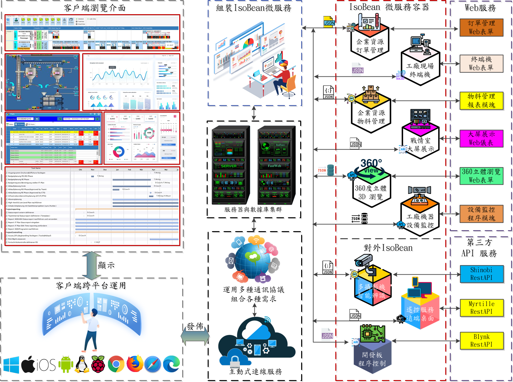
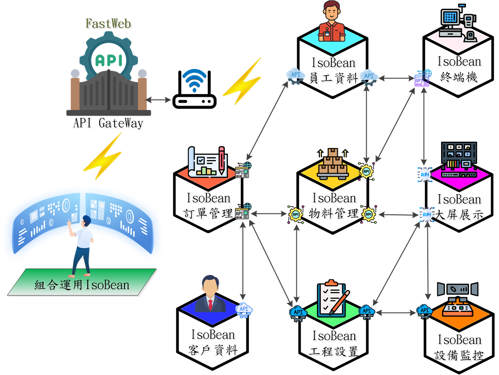

# IsoBean
IsoBean微服務採用分佈式系統，FastWeb將傳統應用系統拆分為，多個較小的服務各司其職，讓各服務專注在自身的功能上，彼此間藉由 RestAPI通訊協定，傳遞訊息以達成整體系統的串接。

> **加入 Facebook 社團**
>
> [https://www.facebook.com/groups/isoface/](https://www.facebook.com/groups/isoface/)
> 
> **點讚追蹤 Facebook 粉絲專頁**
> 
> [https://www.facebook.com/AIOT.ERP](https://www.facebook.com/AIOT.ERP)

IsoBean 为 FastWeb 中的一項功能，如需要使用IsoBean，請訪問 [FastWeb](https://github.com/isoface-iot/FastWeb)、[FastWeb下載頁面](https://github.com/isoface-iot/FastWeb/releases/latest)。

## IsoBean開發跨平臺應用軟體APP，快速佈署智慧服務

* 簡潔專業的開發環境
* Web為底，橫跨所有平臺
* 多種UI開發範例，神速開發
* 上架免等待，即選即用免安裝
* 借力使力不費力，快速開發

**簡潔專業的開發環境**

開發應用軟體方式千百種，為什麼非選「微服務」不可?相信都曾耳聞某廠商砸百萬開發手機APP，下載使用量卻慘不忍睹。但上述問題用「微服務」都可不用擔心，因為「微服務」已替你搞定開發、維護、使用等難題，想做甚麼放手做吧。

**多種UI開發範例，神速開發**

萬事起頭難，如果不知道該怎麼設計應用軟體APP，可以選擇則使用「微服務」平臺內所提供的各式範例，套用範例不單可節省更多開發時間，更能將應用設計的精美吸睛，贏在起跑點。「微服務」提供單一且明確的設計界面，清晰明確的展示設計時可用選單、按鈕、定位元件等，並採用所見即所得，可隨時依據顯示成果調整你的應用。

**JavaScript與HTML5為基礎，橫跨所有平臺**

運用「微服務」開發時，你不需要穿越那些可怕的參數、條件語句，只需使用你我都十分熟悉JS，支援更多瀏覽器並有著開放的數據交換、開放程式碼，無需專門開發SDK，較易與其他應用互動數據，使開發更加簡單。

IsoBean 將微服務封裝在FastWeb的容器中，微服務更容易被部署到並擴充套件不同的主機上。這些服務在軟體專案中可輕鬆更換、刪除、重複使用，並獨立完成各項任務。每個IsoBean微服務就像蓋房用的小磚頭，每塊磚塊都有特定的用途，工地師傅使用小磚頭，構建每棟房屋，也就是最終的軟體產品。

IsoBean微服務是一種軟體架構風格，FastWeb利用IsoBean將複雜的大型應用程式劃分爲多個的小功能模組。每個小功能模組就稱為一個微服務，微服務之間透過API互相通訊，再透過模組化的方式組合成大型應用程式。

## IsoBean是FastWeb的核心元件

IsoBean的功能無法一語道盡，它就像變形金剛，千變萬化、琳瑯滿目，只有想不到，沒有做不到的。在您看到這篇文章的同時，FastWeb 持續在演化進行中。

IsoBean 如同電子商品，在覈心電路板上整合電阻、電容、二極體...等基礎零件。電路板再組裝，加入其它電子、電機、機械等半成品元件，完成最終商品。世上有多少種電子商品，沒有標準答案。市場的需求永無止境，而電子產品也在開發者，持續研發的過程中成長。所以不同零元件的整合，依據不同設計，可生產出成千上萬種不同成品。

## IsoBean 微服務依據引用物件的差異可區分為六大類

①數據型 DataBase：IsoBean連線SQL資料庫，進行資料庫預存程序執行工作。

②程序型 Process：啟動IsoBean 微服務程序，執行後回傳處理訊息。

③批次型 Batch：啟動IsoBean，執行預設 PowerShell，執行後回傳處理訊息。

④顯示型 Vision：啟動IsoBean，執行預設Web表單，並回傳Web表單態網址與處理後訊息。

⑤戰情型 DashBoard：啟動IsoBean，執行預設DashBoard，並回傳DashBoard網址與處理后訊息。

⑥報表型 Report：啟動IsoBean，執行預設Report，並回傳Report瀏覽網址與處理後訊息。

## IsoBean 運用示例

|IsoBean名稱|說明|
|---|----|
|[3D視訊](https://web.diylogi.com/?isobean=ib_wb-vis-0024_3dvideo&userkey=d795b2b5-67c0-4674-9961-4aa574311c8d)|指定3D視訊源地址，實現3D視訊播放功能。|
|[3D展示](https://web.diylogi.com/?isobean=ib_wb-vis-0023_3dview&userkey=d795b2b5-67c0-4674-9961-4aa574311c8d)|通過圖片序列的動態展示，實現物體的3D瀏覽功能。|
|[3D全景瀏覽](https://web.diylogi.com/?isobean=ib_wb-vis-0022_3dangle&userkey=d795b2b5-67c0-4674-9961-4aa574311c8d)|使用全景視角檢視圖片，通過參數或WS可指定要檢視的圖片。|
|[線形儀表](https://web.diylogi.com/?isobean=ib_wb-vis-0012_lineargauge&userkey=d795b2b5-67c0-4674-9961-4aa574311c8d)|顯示為溫度計樣式的線形儀表，通過參數修改外觀，通過WS訊息修改取值。|
|[圓形儀表](https://web.diylogi.com/?isobean=ib_wb-vis-0011_radialgauge&userkey=d795b2b5-67c0-4674-9961-4aa574311c8d&demo=1)|展示為圓形的儀表，可使用參數修改外觀，通過WS資訊取值。|
|[網路文件瀏覽](https://web.diylogi.com/?isobean=ib_wb-vis-0010_online_document&userkey=d795b2b5-67c0-4674-9961-4aa574311c8d)|輸入檔案網路地址，下載指定地址的檔案實現檔案檢視功能。|
|[線上聊天室](https://web.diylogi.com/?isobean=ib_wb-vis-0008_chatroom&userkey=d795b2b5-67c0-4674-9961-4aa574311c8d)|通過WS向用戶列表中的所有使用者發送訊息，實現聊天室效果。|
|[甘特圖展示](https://web.diylogi.com/?isobean=ib_wb-vis-0006_ganttchart&userkey=d795b2b5-67c0-4674-9961-4aa574311c8d)|通過參數確認查詢的時間範圍，從而產生對應的甘特圖。|
|[生產訂單報表](https://web.diylogi.com/?isobean=ib_nb-rep-0002_report_mancontact&userkey=d795b2b5-67c0-4674-9961-4aa574311c8d)|在url參數中指定訂單編號，可產生對應訂單編號的報表。|
|[ESP32控制](https://web.diylogi.com/?isobean=ib_wb-vis-0003_esp32-led-dht&userkey=d795b2b5-67c0-4674-9961-4aa574311c8d)|在界面中顯示溫濕度，ESP32通過WS傳輸溫濕度。|
|[線上視訊播放](https://web.diylogi.com/?isobean=ib_nb-vis-0001_player&userkey=d795b2b5-67c0-4674-9961-4aa574311c8d)|在url中指定參數執行播放，可選參數有視訊平臺與視訊編號。|
|[大屏報表](https://web.diylogi.com/?isobean=ib_wb-das-0001_dashboard_demo1&userkey=d795b2b5-67c0-4674-9961-4aa574311c8d)|使用大螢幕展示數據，可實現實時變化展示。|

* **IsoBean 簡介**：https://isoface.net/isoface/home/isobean/ai-beans